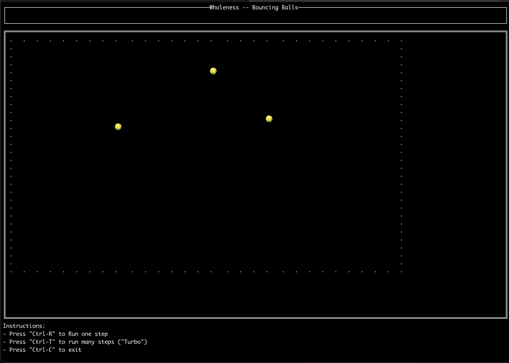

# Overview

A terminal interface for simple agent simulation

Currently supports
- specifying agent behavior
- creating a model composed of agents
- stepping through each "turn"

### Sample screenshot

## Basic usage

- Create a new model, instantiate it within `main`
- For now, `go run main.go`
- Follow instructions to step/quit

# TODOs

_Lots of things I'd like to do!_

1. Improve interfaces for worlds/models 
   - shouldn't require "co-ordinating" dimensions
   - add _spawning_ of new agents
   - have _policies_ for what agents can "look at"
2. Allow Agents to be written in other than "raw" Golang
   - Should be possible to use `AgentContext` as an API for e.g. Lua code
3. Add "Metrics" that are updated over time
   - simple counters, but also simple graphs
4. Add logs for any "significant events"
5. Improve the current TUI
   - Add surrounding columns, e.g. metrics on the left, logs on the right
   - Generally add more color

